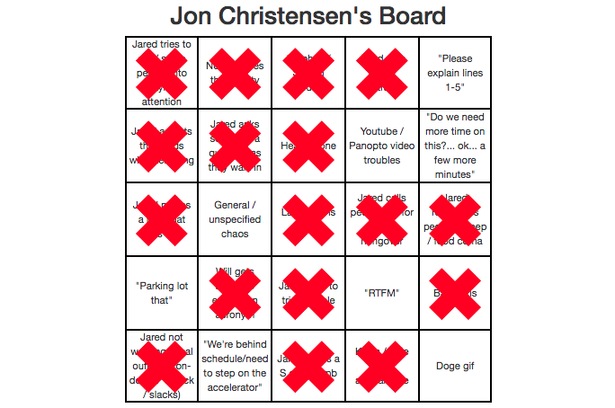

# bingo
GW Coding Bingo is a full-stack application build for some additional excitement in class. It is live at https://gw-coding-bingo.herokuapp.com.

## Description

Bingo is no longer played in retirement homes, but also in coding bootcamps! The rules are the same as always - the first player to get 5 squares in a line vertically, horizontally, or diagonally wins. Clicking on each square will create or remove an X to mark that square. There are several color themes available, with an option to submit custom colors and/or a background image for your own theme. There is also a secret theme available that is hidden on the page.

Each player's board is randomly determined the first time they load it, and thus a player cannot get a new board by refreshing or reloading their page. Refreshing/reloading the page will, however, clear the theme and any X marks already placed. Selecting a new theme merely modifies the page, and thus will preserve any marks already placed.

All additional rules are displayed on the right of the live page.

### Development

This application was developed for fun during the GW Coding Bootcamp and was completed at the end of the ninth week. It is a full-stack application organized with proper MVC design. The front-end uses Express-Handlebars, CSS/Bootstrap, Javascript, and jQuery. The back-end uses Express, Body-Parser, and a custom ORM to connect to the MySQL database.

### Organization

This repo can be cloned to your computer and accessed using the following commands:

		git clone https://github.com/jonchr/bingo.git
		cd bingo
		
Before running one of the application files, you should set up the required tables in MySQL. This can be done with the command:

		node db/schema.sql

After that, the server can be run with the following command

		node server.js

This will run the local server and will print the message "Running on PORT 3000" when completed. Once you receive this message, open "localhost:3000" in your browser. To stop the server, press Control-C while in your command prompt window.

Once cloned to your computer, the files can be modified to create your own version of the game. All rules and square are contained within the rules.js and squares.js files respectively in the public folder.

Currently, the game is hard-coded to load the first entry in the squares file as the center for all boards. To disable this, remove lines 81-83 and 93-95 from the bingo_controller.js file in the controller folder. Additionally, two squares were rigged to be unavailable to certain players. To fix this, remove lines 77-80 in the same bingo_controllers.js file.

## Screenshots
### Frustratingly close!
